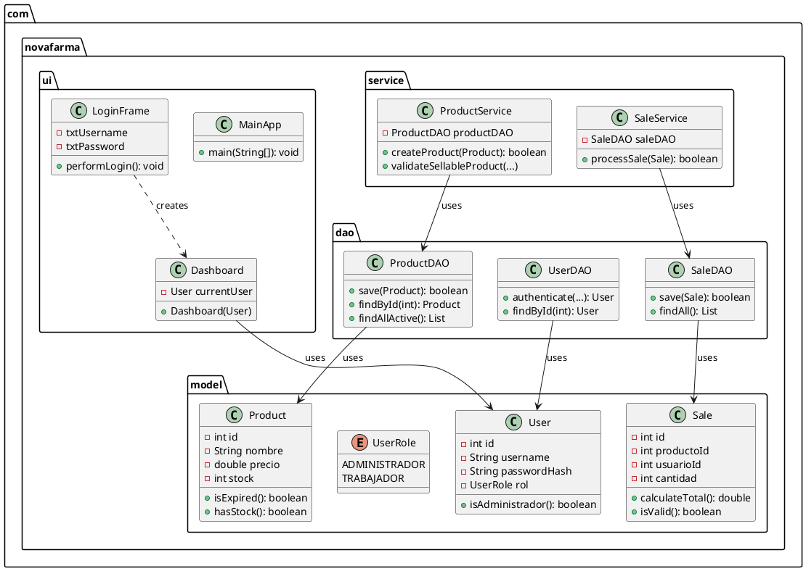

# 📊 GUÍA COMPLETA: CÓMO HACER UML Y DIAGRAMA ER

## 🎯 ÍNDICE
1. [Diagrama ER (Entidad-Relación)](#1-diagrama-er-entidad-relación)
2. [Diagrama UML (Diagrama de Clases)](#2-diagrama-uml-diagrama-de-clases)
3. [Herramientas Recomendadas](#3-herramientas-recomendadas)
4. [Ejemplos Visuales](#4-ejemplos-visuales)

---

## 1. DIAGRAMA ER (ENTIDAD-RELACIÓN)

### 1.1 ¿Qué es un Diagrama ER?

Un **Diagrama Entidad-Relación** muestra la estructura de la base de datos:
- **Entidades** (Tablas): `productos`, `usuarios`, `ventas`
- **Atributos** (Columnas): `id`, `nombre`, `precio`, etc.
- **Relaciones**: Cómo se conectan las tablas (Foreign Keys)

### 1.2 Estructura de tu Base de Datos

#### **Entidad: PRODUCTOS**
```
┌─────────────────────────────┐
│       PRODUCTOS             │
├─────────────────────────────┤
│ PK │ id (INTEGER)           │
│    │ nombre (VARCHAR 100)   │
│    │ descripcion (TEXT)     │
│    │ precio (NUMERIC 10,2)  │
│    │ stock (INTEGER)        │
│    │ fecha_vencimiento (DATE)│
│    │ fecha_creacion (TIMESTAMP)│
│    │ fecha_modificacion (TIMESTAMP)│
│    │ activo (BOOLEAN)       │
└─────────────────────────────┘
```

#### **Entidad: USUARIOS**
```
┌─────────────────────────────┐
│       USUARIOS              │
├─────────────────────────────┤
│ PK │ id (INTEGER)           │
│    │ username (VARCHAR 50)  │
│    │ password_hash (VARCHAR 64)│
│    │ rol (VARCHAR 20)       │
│    │ fecha_creacion (TIMESTAMP)│
└─────────────────────────────┘
```

#### **Entidad: VENTAS**
```
┌─────────────────────────────┐
│       VENTAS                │
├─────────────────────────────┤
│ PK │ id (INTEGER)           │
│ FK │ producto_id (INTEGER)  │ → PRODUCTOS.id
│ FK │ usuario_id (INTEGER)   │ → USUARIOS.id
│    │ cantidad (INTEGER)     │
│    │ precio_unitario (NUMERIC 10,2)│
│    │ total (NUMERIC 10,2)   │
│    │ fecha_venta (TIMESTAMP)│
└─────────────────────────────┘
```

### 1.3 Relaciones

```
PRODUCTOS (1) ────────< (N) VENTAS
   │                        │
   │                        │
   └─── producto_id ─────────┘

USUARIOS (1) ────────< (N) VENTAS
   │                        │
   │                        │
   └─── usuario_id ─────────┘
```

**Explicación:**
- **1:N (Uno a Muchos)**: Un producto puede tener muchas ventas
- **1:N (Uno a Muchos)**: Un usuario puede hacer muchas ventas
- **PK**: Primary Key (Clave Primaria)
- **FK**: Foreign Key (Clave Foránea)

### 1.4 Cómo Hacer el Diagrama ER

#### **Opción 1: Draw.io (Recomendado - Gratis)**

1. **Abrir Draw.io:**
   - Ve a: https://app.diagrams.net/
   - O descarga: https://github.com/jgraph/drawio-desktop/releases

2. **Crear nuevo diagrama:**
   - Click en "Create New Diagram"
   - Selecciona "Entity Relationship"

3. **Agregar entidades:**
   - Arrastra el componente "Entity" al canvas
   - Nombra cada entidad: `PRODUCTOS`, `USUARIOS`, `VENTAS`

4. **Agregar atributos:**
   - Dentro de cada entidad, agrega los atributos
   - Marca con **PK** los atributos que son Primary Key
   - Marca con **FK** los atributos que son Foreign Key

5. **Conectar relaciones:**
   - Usa la herramienta "Relationship" para conectar entidades
   - Indica cardinalidad: `1` (uno) y `N` (muchos)

#### **Opción 2: pgAdmin (Automático)**

1. **Abrir pgAdmin**
2. **Ir a:** `Servers` → `PostgreSQL 17` → `Databases` → `nova_farma_db`
3. **Click derecho en el esquema `public`** → `ERD Tool`
4. **Agregar tablas:**
   - Arrastra las tablas: `productos`, `usuarios`, `ventas`
   - pgAdmin detecta automáticamente las relaciones (Foreign Keys)
5. **Exportar:**
   - `File` → `Export` → `PNG` o `PDF`

#### **Opción 3: MySQL Workbench (Solo visualización)**

1. **Importar schema:**
   - `Database` → `Reverse Engineer`
   - Conecta a PostgreSQL (si es compatible)
   - Selecciona las tablas

### 1.5 Ejemplo Visual del Diagrama ER

```
┌─────────────────────────────────────────────────────────────┐
│                    DIAGRAMA ER - NOVA FARMA                 │
└─────────────────────────────────────────────────────────────┘

┌─────────────────────┐                    ┌─────────────────────┐
│     PRODUCTOS       │                    │      USUARIOS       │
├─────────────────────┤                    ├─────────────────────┤
│ PK │ id             │                    │ PK │ id             │
│    │ nombre         │                    │    │ username       │
│    │ descripcion    │                    │    │ password_hash  │
│    │ precio         │                    │    │ rol            │
│    │ stock          │                    │    │ fecha_creacion │
│    │ fecha_venc     │                    └─────────────────────┘
│    │ fecha_creacion │                              │
│    │ fecha_modif    │                              │
│    │ activo         │                              │ 1
└─────────────────────┘                              │
       │                                              │
       │ 1                                            │
       │                                              │
       │                                              │
       └──────────────────┬───────────────────────────┘
                          │
                          │ N
                          │
                  ┌───────▼────────┐
                  │    VENTAS      │
                  ├────────────────┤
                  │ PK │ id        │
                  │ FK │ producto_id│
                  │ FK │ usuario_id │
                  │    │ cantidad   │
                  │    │ precio_unit│
                  │    │ total      │
                  │    │ fecha_venta│
                  └────────────────┘
```

**Leyenda:**
- `PK` = Primary Key (Clave Primaria)
- `FK` = Foreign Key (Clave Foránea)
- `1` = Uno (cardinalidad)
- `N` = Muchos (cardinalidad)

---

## 2. DIAGRAMA UML (DIAGRAMA DE CLASES)

### 2.1 ¿Qué es un Diagrama UML?

Un **Diagrama de Clases UML** muestra la estructura del código Java:
- **Clases**: Modelos, DAOs, Services, UI
- **Atributos**: Variables de instancia
- **Métodos**: Funciones de cada clase
- **Relaciones**: Herencia, composición, dependencias

### 2.2 Estructura de tu Proyecto Java

#### **Paquete: MODEL (Modelos)**

```
┌─────────────────────────────────┐
│         Product                 │
├─────────────────────────────────┤
│ - id: int                       │
│ - nombre: String                 │
│ - descripcion: String           │
│ - precio: double                │
│ - stock: int                     │
│ - fechaVencimiento: Date         │
│ - activo: boolean                │
├─────────────────────────────────┤
│ + Product()                      │
│ + Product(...)                   │
│ + getId(): int                   │
│ + getNombre(): String            │
│ + setNombre(String)              │
│ + isExpired(): boolean           │
│ + getDaysUntilExpiration(): long │
│ + hasStock(): boolean            │
│ + hasEnoughStock(int): boolean   │
└─────────────────────────────────┘

┌─────────────────────────────────┐
│         User                    │
├─────────────────────────────────┤
│ - id: int                       │
│ - username: String              │
│ - passwordHash: String          │
│ - rol: UserRole                 │
├─────────────────────────────────┤
│ + User()                        │
│ + User(...)                     │
│ + getId(): int                  │
│ + getUsername(): String         │
│ + isAdministrador(): boolean    │
│ + isTrabajador(): boolean       │
└─────────────────────────────────┘
         │
         │ uses
         │
┌────────▼────────────┐
│    UserRole (enum)  │
├─────────────────────┤
│ ADMINISTRADOR       │
│ TRABAJADOR          │
└─────────────────────┘

┌─────────────────────────────────┐
│         Sale                    │
├─────────────────────────────────┤
│ - id: int                       │
│ - productoId: int               │
│ - usuarioId: int                │
│ - cantidad: int                 │
│ - precioUnitario: double        │
│ - total: double                 │
│ - fechaVenta: Timestamp         │
├─────────────────────────────────┤
│ + Sale()                        │
│ + Sale(...)                     │
│ + calculateTotal(): double      │
│ + updateTotal(): void           │
│ + isValid(): boolean            │
└─────────────────────────────────┘
```

#### **Paquete: DAO (Data Access Object)**

```
┌─────────────────────────────────┐
│         ProductDAO               │
├─────────────────────────────────┤
│                                 │
├─────────────────────────────────┤
│ + save(Product): boolean        │
│ + update(Product): boolean      │
│ + findById(int): Product        │
│ + findByName(String): Product   │
│ + findAllActive(): List<Product>│
│ + findAllActive(int, int): List │
│ + countAllActive(): int         │
│ - mapearResultadoAProducto(...) │
└─────────────────────────────────┘
         │ uses
         │
┌────────▼────────────┐
│      Product        │
└─────────────────────┘

┌─────────────────────────────────┐
│         UserDAO                 │
├─────────────────────────────────┤
│                                 │
├─────────────────────────────────┤
│ + authenticate(...): User       │
│ + findByUsername(String): User  │
│ + findById(int): User           │
│ + findAll(): List<User>         │
│ + findAll(int, int): List<User> │
│ + save(User): boolean           │
│ + delete(int): boolean          │
│ - mapearResultadoAUsuario(...)  │
└─────────────────────────────────┘
         │ uses
         │
┌────────▼────────────┐
│        User         │
└─────────────────────┘

┌─────────────────────────────────┐
│         SaleDAO                 │
├─────────────────────────────────┤
│                                 │
├─────────────────────────────────┤
│ + save(Sale): boolean           │
│ + saveAll(List<Sale>): boolean  │
│ + findAll(): List<Sale>         │
│ + findAll(int, int): List<Sale> │
│ + findByUserId(int): List<Sale>│
│ + countAll(): int               │
│ - mapearResultadoAVenta(...)    │
└─────────────────────────────────┘
         │ uses
         │
┌────────▼────────────┐
│        Sale         │
└─────────────────────┘
```

#### **Paquete: SERVICE (Lógica de Negocio)**

```
┌─────────────────────────────────┐
│      ProductService             │
├─────────────────────────────────┤
│ - productDAO: ProductDAO         │
├─────────────────────────────────┤
│ + getAllActiveProducts(): List  │
│ + getProductById(int): Product  │
│ + createProduct(Product): boolean│
│ + updateProduct(Product): boolean│
│ + retireProduct(int): boolean   │
│ + validateSellableProduct(...)  │
│ - validateProduct(Product)      │
└─────────────────────────────────┘
         │ uses
         │
┌────────▼────────────┐
│     ProductDAO      │
└─────────────────────┘

┌─────────────────────────────────┐
│      SaleService                │
├─────────────────────────────────┤
│ - saleDAO: SaleDAO              │
│ - productDAO: ProductDAO         │
│ - productService: ProductService│
├─────────────────────────────────┤
│ + getAllSales(): List<Sale>     │
│ + processSale(Sale): boolean    │
│ + processMultipleSales(...)      │
│ + validateCart(List<Sale>): List│
└─────────────────────────────────┘
         │ uses
         │
┌────────▼────────────┐
│      SaleDAO        │
└─────────────────────┘
```

#### **Paquete: UI (Interfaz de Usuario)**

```
┌─────────────────────────────────┐
│      MainApp                    │
├─────────────────────────────────┤
│                                 │
├─────────────────────────────────┤
│ + main(String[]): void          │
└─────────────────────────────────┘
         │ creates
         │
┌────────▼────────────┐
│     LoginFrame      │
├─────────────────────┤
│ - txtUsername       │
│ - txtPassword       │
├─────────────────────┤
│ + LoginFrame()      │
│ - performLogin()    │
│ - openDashboard()   │
└─────────────────────┘
         │ creates
         │
┌────────▼────────────┐
│      Dashboard      │
├─────────────────────┤
│ - currentUser: User │
│ - inventoryPanel    │
│ - salesPanel        │
│ - alertsPanel       │
├─────────────────────┤
│ + Dashboard(User)   │
│ - createInventoryPanel()│
│ - createSalesPanel()│
│ - createUsersPanel()│
└─────────────────────┘
         │ uses
         │
┌────────▼────────────┐
│   ProductHandler    │
├─────────────────────┤
│ - productService    │
│ - inventoryPanel    │
├─────────────────────┤
│ + agregar()         │
│ + editar()          │
│ + eliminar()        │
└─────────────────────┘
```

#### **Paquete: UTIL (Utilidades)**

```
┌─────────────────────────────────┐
│   DatabaseConnection            │
├─────────────────────────────────┤
│ - connection: Connection        │
├─────────────────────────────────┤
│ + getConnection(): Connection   │
│ + closeConnection(): void       │
│ + isConnected(): boolean        │
└─────────────────────────────────┘

┌─────────────────────────────────┐
│      SecurityHelper             │
├─────────────────────────────────┤
│                                 │
├─────────────────────────────────┤
│ + encryptPassword(String): String│
│ + verifyPassword(...): boolean  │
└─────────────────────────────────┘

┌─────────────────────────────────┐
│    PaginationHelper             │
├─────────────────────────────────┤
│ + DEFAULT_PAGE_SIZE: int        │
├─────────────────────────────────┤
│ + calculateOffset(...): int     │
│ + calculateTotalPages(...): int│
│ + getDisplayRange(...): String  │
└─────────────────────────────────┘
```

### 2.3 Relaciones entre Clases

```
┌─────────────┐
│  MainApp    │
└──────┬──────┘
       │ creates
       │
┌──────▼──────────┐
│   LoginFrame    │
└──────┬──────────┘
       │ creates
       │
┌──────▼──────────┐      uses      ┌──────────────┐
│   Dashboard     │───────────────▶│ ProductHandler│
└──────┬──────────┘                └──────┬───────┘
       │ uses                             │ uses
       │                                  │
┌──────▼──────────┐                ┌─────▼──────────┐
│ InventoryPanel  │                │ ProductService │
└─────────────────┘                └─────┬──────────┘
                                          │ uses
                                    ┌─────▼──────────┐
                                    │  ProductDAO    │
                                    └─────┬──────────┘
                                          │ uses
                                    ┌─────▼──────────┐
                                    │   Product      │
                                    └────────────────┘
```

### 2.4 Cómo Hacer el Diagrama UML

#### **Opción 1: Draw.io (Recomendado - Gratis)**

1. **Abrir Draw.io:**
   - https://app.diagrams.net/

2. **Crear nuevo diagrama:**
   - Click en "Create New Diagram"
   - Selecciona "UML Class"

3. **Agregar clases:**
   - Arrastra el componente "Class" al canvas
   - Divide en 3 secciones:
     - **Nombre de la clase** (arriba)
     - **Atributos** (medio) - con visibilidad: `-` (privado), `+` (público)
     - **Métodos** (abajo) - con visibilidad

4. **Agregar relaciones:**
   - **Dependencia** (flecha punteada): `uses`
   - **Composición** (flecha sólida con rombo): `contains`
   - **Herencia** (flecha con triángulo): `extends` (si aplica)

#### **Opción 2: PlantUML (Código - Recomendado para documentación)**

1. **Instalar extensión:**
   - VS Code: Extensión "PlantUML"
   - O usar online: https://www.plantuml.com/plantuml/

2. **Crear archivo `.puml`:**



3. **Generar diagrama:**
   - En VS Code: Click derecho → "Preview PlantUML"
   - O pega el código en: https://www.plantuml.com/plantuml/

#### **Opción 3: IntelliJ IDEA (Automático)**

1. **Abrir proyecto en IntelliJ IDEA**
2. **Ir a:** `Tools` → `Diagrams` → `Show Diagram`
3. **Seleccionar paquetes:**
   - Selecciona `com.novafarma`
   - IntelliJ genera el diagrama automáticamente
4. **Exportar:**
   - Click derecho → `Export Diagram` → `PNG` o `PDF`

---

## 3. HERRAMIENTAS RECOMENDADAS

### 3.1 Para Diagrama ER

| Herramienta | Gratis | Facilidad | Recomendación |
|------------|--------|-----------|---------------|
| **Draw.io** | ✅ | ⭐⭐⭐⭐⭐ | ⭐⭐⭐⭐⭐ |
| **pgAdmin ERD Tool** | ✅ | ⭐⭐⭐⭐ | ⭐⭐⭐⭐ |
| **MySQL Workbench** | ✅ | ⭐⭐⭐ | ⭐⭐⭐ |
| **Lucidchart** | ❌ (Pago) | ⭐⭐⭐⭐⭐ | ⭐⭐⭐ |

**Recomendación:** **Draw.io** (gratis, fácil, profesional)

### 3.2 Para Diagrama UML

| Herramienta | Gratis | Facilidad | Recomendación |
|------------|--------|-----------|---------------|
| **Draw.io** | ✅ | ⭐⭐⭐⭐⭐ | ⭐⭐⭐⭐⭐ |
| **PlantUML** | ✅ | ⭐⭐⭐⭐ | ⭐⭐⭐⭐⭐ |
| **IntelliJ IDEA** | ❌ (Pago) | ⭐⭐⭐⭐⭐ | ⭐⭐⭐⭐ |
| **Visual Paradigm** | ❌ (Pago) | ⭐⭐⭐⭐ | ⭐⭐⭐ |

**Recomendación:** **Draw.io** o **PlantUML** (ambos gratis)

---

## 4. EJEMPLOS VISUALES

### 4.1 Diagrama ER Completo (Texto)

```
                    ┌─────────────────────┐
                    │     PRODUCTOS       │
                    ├─────────────────────┤
                    │ PK │ id             │
                    │    │ nombre         │
                    │    │ descripcion    │
                    │    │ precio         │
                    │    │ stock          │
                    │    │ fecha_venc     │
                    │    │ activo         │
                    └──────────┬──────────┘
                               │
                               │ 1
                               │
                               │ tiene
                               │
                    ┌──────────▼──────────┐
                    │      VENTAS         │
                    ├─────────────────────┤
                    │ PK │ id             │
                    │ FK │ producto_id    │──┐
                    │ FK │ usuario_id     │──┤
                    │    │ cantidad       │  │
                    │    │ precio_unitario│  │
                    │    │ total          │  │
                    │    │ fecha_venta    │  │
                    └─────────────────────┘  │
                               │             │
                               │ N           │
                               │             │
                    ┌──────────▼──────────────┘
                    │      USUARIOS            │
                    ├──────────────────────────┤
                    │ PK │ id                  │
                    │    │ username            │
                    │    │ password_hash       │
                    │    │ rol                 │
                    │    │ fecha_creacion      │
                    └──────────────────────────┘
```

### 4.2 Diagrama UML Simplificado (Texto)

```
┌─────────────────┐
│    MainApp      │
└────────┬────────┘
         │
         │ crea
         │
┌────────▼────────┐
│  LoginFrame    │──┐
└────────┬────────┘  │ usa
         │           │
         │ crea      │
         │           │
┌────────▼────────┐  │
│   Dashboard     │──┘
└────────┬────────┘
         │ usa
         │
┌────────▼────────┐
│ ProductHandler  │
└────────┬────────┘
         │ usa
         │
┌────────▼────────┐
│ ProductService  │
└────────┬────────┘
         │ usa
         │
┌────────▼────────┐
│   ProductDAO    │
└────────┬────────┘
         │ usa
         │
┌────────▼────────┐
│    Product      │
└─────────────────┘
```

---

## 📝 PASOS RÁPIDOS PARA CREAR TUS DIAGRAMAS

### Diagrama ER (5 minutos):

1. ✅ Abre https://app.diagrams.net/
2. ✅ Crea nuevo diagrama → "Entity Relationship"
3. ✅ Agrega 3 rectángulos: `PRODUCTOS`, `USUARIOS`, `VENTAS`
4. ✅ Agrega atributos dentro de cada rectángulo
5. ✅ Marca PK y FK
6. ✅ Conecta con líneas: `PRODUCTOS 1──N VENTAS` y `USUARIOS 1──N VENTAS`
7. ✅ Exporta como PNG o PDF

### Diagrama UML (10 minutos):

1. ✅ Abre https://app.diagrams.net/
2. ✅ Crea nuevo diagrama → "UML Class"
3. ✅ Agrega clases principales: `Product`, `User`, `Sale`, `ProductDAO`, `ProductService`, `Dashboard`
4. ✅ Agrega atributos (con `-` para privado, `+` para público)
5. ✅ Agrega métodos principales
6. ✅ Conecta con flechas: `ProductDAO → Product` (usa)
7. ✅ Exporta como PNG o PDF

---

## ✅ CHECKLIST PARA LA DEFENSA

- [ ] Diagrama ER muestra las 3 tablas principales
- [ ] Diagrama ER muestra las relaciones (Foreign Keys)
- [ ] Diagrama ER muestra cardinalidad (1:N)
- [ ] Diagrama UML muestra las clases principales (Model, DAO, Service, UI)
- [ ] Diagrama UML muestra relaciones entre clases
- [ ] Ambos diagramas están exportados en alta calidad (PNG/PDF)
- [ ] Ambos diagramas están incluidos en la documentación del proyecto

---

## 🎓 CONSEJOS FINALES

1. **Mantén los diagramas simples**: No incluyas TODOS los métodos, solo los principales
2. **Usa colores**: Diferencia paquetes con colores (Model=azul, DAO=verde, Service=naranja, UI=rojo)
3. **Alinea elementos**: Usa la herramienta de alineación de Draw.io
4. **Agrega notas**: Si algo no es obvio, agrega una nota explicativa
5. **Exporta en alta resolución**: Para presentaciones, exporta a 300 DPI

¡Listo! Con esta guía puedes crear ambos diagramas profesionalmente. 🚀

